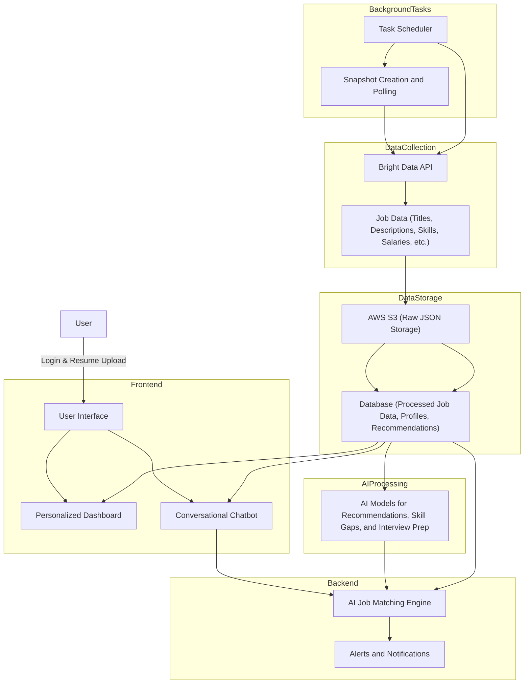

# JobScout.ai: Revolutionizing Job Hunting with AI and Bright Data

## Overview
In today’s fast-paced job market, staying ahead requires access to real-time, accurate, and comprehensive data. Traditional job boards often fall short, leaving job seekers frustrated with endless scrolling and filters. 

**Current Problem:** Imagine logging into 10 different websites daily, typing job roles repeatedly, applying countless filters, and still feeling overwhelmed by irrelevant results.

**Solution:** With JobScout.ai, job hunting is seamless. Simply log in, upload your resume, and let our platform do the rest. Receive personalized job recommendations, tailored insights, and daily updates on fresh opportunities—all in one place.

---

## Features

### 1. AI-Powered Job Recommendations
- Matches users to roles based on resumes, profiles, and preferences.
- Highlights skill gaps and provides learning resources.

### 2. Conversational Job Search
- Intuitive chatbot supports natural language queries, e.g., "Find remote Python developer jobs paying ₹80,000+."
- Generates tailored resumes, cover letters, and job comparisons.

### 3. Personalized Dashboard
- Tracks saved jobs and applications.

### 4. Interview Preparation
- AI-generated interview questions specific to roles.
- Offers feedback and suggested responses.

---

## Architecture

The system combines Bright Data’s Web Scraper API with cutting-edge AI to deliver a seamless user experience.



---

## Screenshots

### Platform


### Dashboard


### AI Assistant


---

## Demo Video

https://github.com/user-attachments/assets/d6809e5e-e688-498a-a996-35fc0565ae4c

---

## Tech Stack

- **Frontend:** Next.js, Tailwind CSS
- **Backend:** FastAPI
- **Database:** PostgreSQL
- **Gen AI:** OpenAI
- **Data Collection:** Bright Data Web Scraper API
- **Cloud Storage:** AWS S3

---

## How I Used Bright Data

1. **Scraping Job Data:**
   - Scrapes listings from LinkedIn, Glassdoor, and Indeed.
   - Captures job titles, descriptions, skills, salaries, benefits, locations, and trends.
   - Updates data in real-time.

2. **Snapshot Creation:**
   - Periodic API requests fetch jobs based on AI-determined roles, locations, and filters.
   - Responses are stored as JSON in AWS S3 for efficient processing.

---

## Contributing

1. Fork the repository.
2. Create a feature branch:
   ```bash
   git checkout -b feature-name
   ```
3. Commit changes:
   ```bash
   git commit -m 'Add feature description'
   ```
4. Push to the branch:
   ```bash
   git push origin feature-name
   ```
5. Open a pull request.

---

## License

This project is licensed under the MIT License. See the [LICENSE](LICENSE) file for details.

---

**Transform your job search with JobScout.ai!**
